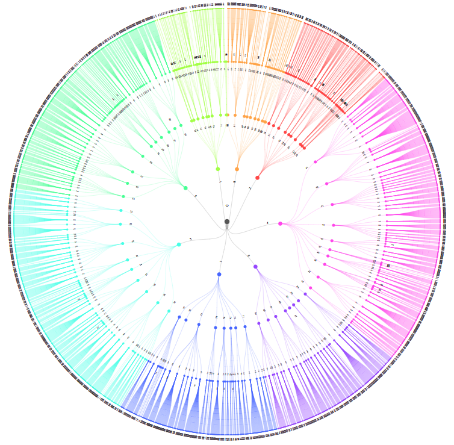

# SFI Group System Vocabulary - A maritime vocabulary with visualization

  

SFI_Ontology is a project in cooperation between the Norwegian Maritime Authority, SpecTec and Capgemini Norway. Its purpose is to create an open ontology and vocabulary describing the SFI Coding and Classification System, including enrichment with references to DBPedia. The project includes implementation of a web application for visualization of the knowledge graph.

Documentation for RDF could be found locally on `~/SFI_Ontoloy/documentation.html`.  
Documentation for web application and Pythonfiles below.

## Documentation for Pythonfiles
To see documentation for PythonFiles go to `PythonFiles` or click this link: [PythonFiles](PythonFiles) .

## Documentation on web application
The web application provides a visualization of the SFI Group System Vocabulary, including the hierarchy, cross-reference relationships and labels.

### How to start
To run the application either download or clone this repositry or go to [https://sjofartsdirektoratet.github.io/SFI_Ontology/](https://sjofartsdirektoratet.github.io/SFI_Ontology/) 

#### Run locally
`$ cd ~/SFI_Ontology`  
:heavy_exclamation_mark: One change must be made for it to run locally. It is in `package.json`.  
Remove:  
`"homepage": "..."`

Then:  
`$ npm install -g serve`  
`$ npm run build`  
`$ serve -s build`  
Go to [localhost:5000](localhost:5000)

The application is build with the React framework and based on the library D3.js managing the data and graph representation.

### D3.js 

"D3.js is a JavaScript library for manipulating documents based on data. D3 helps you bring data to life using HTML, SVG, and CSS. D3’s emphasis on web standards gives you the full capabilities of modern browsers without tying yourself to a proprietary framework, combining powerful visualization components and a data-driven approach to DOM manipulation." [D3.js](https://d3js.org/)

The visualization is created using a `D3.tree()` with radial links. The data is parsed using `d3.json()` (could also be csv) and is used to create a d3.hierarchy which again is used as input to the `D3.tree()` object. The knowledge graph itself is an SVG element. 

### Deploy updates with gh-pages
It is easy to update the application with github pages. Push your update to repository and build/deploy the page in one command.  
remember to add homepage. Then use:  
`npm run deploy`  
And github makes/updates the branch gh-pages.  
Homepage is: `https://username.github.io/reponame`
